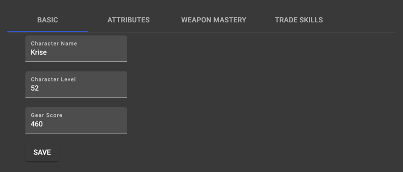

<link rel="preconnect" href="https://fonts.googleapis.com">
<link rel="preconnect" href="https://fonts.gstatic.com" crossorigin>
<link href="https://fonts.googleapis.com/css2?family=IM+Fell+DW+Pica&display=swap" rel="stylesheet">

<h1 align="center" style="font-family: 'IM Fell DW Pica', serif;font-size: xxx-large">
    ⛏ New World Company Tool 🔨
</h1> 

    

        
    

    

        
        
    

    

        
        
        
        
        
        
    

<h2 style="font-family: 'IM Fell DW Pica', serif">
    ❓ What is this ❓
</h2>

This tool is intended to be used with the game New World from Amazon Game Studios. It aims to give all your company members 
an overview about other members, their skills and attributes. The tool uses Discord's login and enables all your members
to reach out to other company members easily.

The server is written in [nest.js](https://nestjs.com/) and uses [prisma](https://www.prisma.io/) and 
[SQLite](https://www.sqlite.org/index.html). It runs on [nodejs](https://nodejs.dev/). The webapp is written in
[angular](https://angular.io/).

<h3 style="font-family: 'IM Fell DW Pica', serif">
    🚀 How to install 🚀
</h3>

Full Setup Guide in text form can be found [here](https://github.com/cbartel/nw-company-tool/blob/main/docs/setup.md)

Setup Video:

<h3 style="font-family: 'IM Fell DW Pica', serif">
    📸 Footage 📸
</h3> 

#### Company Overview

#### My Character

