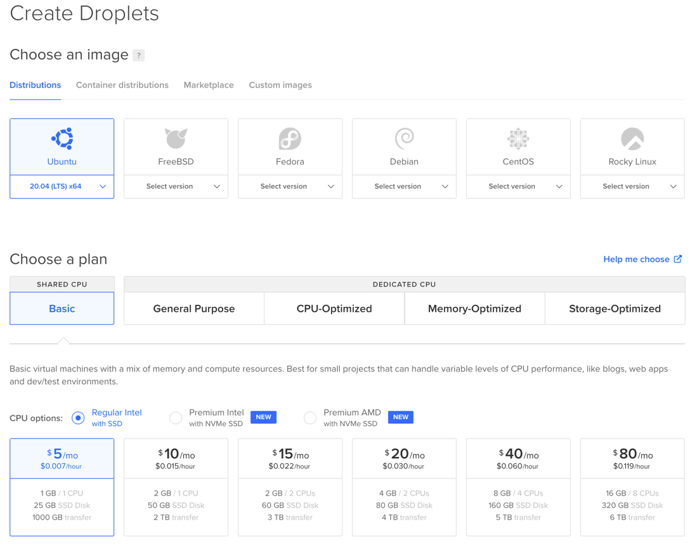

# How To Setup NWCT

## Introduction
This guide shows you one of many ways on how to setup a node process running NWCT. If you find any mistakes
or security leaks in this guide, please reach out to me.

You can host NWCT on a variety of hosters, the services I use in this guide are just my personal preference
because I like them. I have no collaboration with these providers, I'm pretty sure they don't know this 
guide even exists.

[This guide is also available as a video tutorial on YouTube](https://youtu.be/Vc05LSErptM). Check out the 
[NWCT YouTube Channel](https://www.youtube.com/channel/UCqf2-UexGK8v-fpORpvBObA)


If you have any issues, feel free to reach out to me on discord

<a href="https://discord.gg/rm9Gzf3HCH"></a>

If you like the tool, you can support me on ko-fi

<a href="https://ko-fi.com/J3J37247V" target='_blank'></a>

## Summary

The guide is divided into multiple parts to make it easier for you to pick where to start. Here is a short
overview:
- buy a domain on godaddy
    - how to setup nameservice
- setup a droplet on digitalocean
    - preparing your droplet
    - connect your domain
    - update and upgrade your droplet
    - ssh and firewall
- setup a reverse proxy using nginx
  - install nginx
  - configuration
- setup node
- setup NWCT
    - download and extract
    - configuration
    - starting your node process
- setup a process manager (pm2) to automatically (re-)start NWCT
    - install pm2
    - configuration
- setup SSL / HTTPS
    - use certbot to manage your SSL certificates
- Conclusion

## Buy a domain on godaddy

Just head over to https://www.godaddy.com, find a domain that suits you and buy it. You will need to setup
DNS to point over to digitalocean. You can do this in your domainsettings on godaddy, just use the webinterface.
If you have problems finding the DNS configuration, you can try to use the following link: 
https://dcc.godaddy.com/manage/example.com/dns, where example.com is your domain.

In the nameserver configuration you will need to switch from "GoDaddy nameserver" to "I use my own nameserver".
Fill in the following 3 nameservers into the list:
- ns1.digitalocean.com
- ns2.digitalocean.com
- ns3.digitalocean.com

Save and you're done. Your domain now points to digitalocean. This is where we will head next.

## Setup a droplet on digitalocean

[Digital Ocean](https://m.do.co/c/5d882b2d66c0) is a low cost webhoster. It's a viable alternative to using
services like AWS or GCP. I like to use it for my hobby projects because you can easily create and dispose
small virtual machines which they call Droplets.

If you would like to support me, you can use the link above to sign up. This will give you $100 at no cost for 60 days 
to play with and try everything out. Once you have spent $25 of real money, I will get that money from digitalocean
aswell to use within my account. Sounds like a fair deal, right? Not convinced - no problem: Just head over to 
https://www.digitalocean.com.

If you don't like Digital Ocean, you can ofc use any other hoster and I'm quite sure you can adapt the rest of
this guide to suit your needs easily.

### Preparing your droplet

First of all you should create a new project on Digital Ocean, just click the button "New Project" on the 
navbar to the left and fill out the formular as you please.

Navigate to your newly created project and press the Create button in the upper right corner. Select "Droplets".

I recommend to use the smallest droplet they offer (1CPU, 1GB RAM, 25GB SSD Disk, 1000GB transfer) as this will
suffice by any means for NWCT. This comes at a cost of $5/month. 



I recommend using SSH keys instead of a password to access your droplet. 

To create your ssh keys, you can use [PuTTY](https://www.putty.org/). Install it and open puttygen. Generate
a new key and save the private and public key to your filesystem. Then copy the public key to your clipboard and paste it
into the dialog over at digitalocean.

### connect your domain

On Digital Ocean click the Create button in the upper right corner and choose "Domains/DNS".
Enter your domain and press the Add Domain button.

We can now setup an A-Record to route your domain to your droplet. Under hostname enter any value you would
like. Let's go with "nwct" for this guide. Choose your droplet in the "will redirect to" dropdown menu. Leave
TTL to 3600 seconds as this is totally fine.

### update and upgrade your droplet

Now we can connect to our droplet using ssh. If you're running on windows, I recommend you use
[PuTTY](https://www.putty.org/) to connect to your droplet.

You've connected to your droplet via ssh using the default port 22. Security wise it is best practice to
change that port to something else.

```bash
cd /etc/ssh
nano sshd_config
```

Somewhere in this file, you will see a line like this
```bash
# Port 22
```

This line is currently commented out, remove the `#` and change the value to something different like 2242.
To save the file, hit CTRL-S and then hit CTRL-X to close the file.

We need to restart the ssh server for the changes to take effect

```bash
service sshd restart
```

Now let's enable and configure our firewall to only allow connections on our newly configured port 2242 and reboot our droplet
```bash
ufw allow 2242/tcp
ufw enable
reboot
```

This will disrupt your current ssh connection, because we're connected on port 22. Reconnect to your droplet
using your newly configured ssh port 2242.

Before you do this, you will also need to change your Cloud Firewall over at digitalocean, as it only allows connections at port 22.
To do this, click the "Create" Button in the upper right corner and select "Cloud Firewalls". You can remove the SSH entry with tcp port 22 and
add the following new rules:


Do NOT forget to add this rule to your droplet.

Now you should be able to reconnect to your droplet on port 2242.

Now let's update our system using the following command

```bash
apt-get update && apt-get upgrade -y && apt-get dist-upgrade -y
```

this will update our registry, patch all components and our system. There may be some dialog prompting you
if you want to change already installed components. Choose "keep the local version currently installed" if that
happens.

Go grab some coffee because this may take a while.

Now you have a fairly secure droplet to work with. Good job and congratulations if you made it this far!

## Setup a reverse proxy using nginx

[nginx](https://www.nginx.com/) is a lightweight and high performance webserver that can be used for all kinds
of things. We will use it as a reverse proxy, that means, we will have nginx stand in front of our users and
let nginx handle all the http requests to our server at firsthand. Nginx then will forward these requests
to our node process running NWCT.

To install nginx simply use

```bash
apt install nginx -y
```

As a preparation for later steps, we can can now open two more ports in our firewall. These are used for http(80)
and https(443):
```bash
ufw allow 80/tcp
ufw allow 443/tcp
```


Open a browser window on your local computer and try to connect to your droplet on http://nwct.example.com
where nwct is the value we've used in our DNS A-Record and example.com is your domain. You should be able to
see the default nginx page.

We are going to let NWCT run on port 8080 on our droplet. We will not expose this port to the public, instead
nginx is going to route all requests on localhost. We need to edit the nginx configuration for this, but don't 
worry, this is straight forward.

```bash
cd /etc/nginx/sites-available
nano nwct
```

copy the following content into that file (`etc/nginx/sites-available/nwct`)

```
# This goes in a file within /etc/nginx/sites-available/.

# Define Server
server {

    # replace with your domain
    server_name             nwct.example.com;

    # Listen on port 80 without SSL certificates, we will deal with https later
    listen                  80;

    # Sets the Max Upload size to 300 MB
    client_max_body_size 300M;

    # Proxy Requests to NWCT
    location / {

        # Set proxy headers
        proxy_set_header Host $host;
        proxy_set_header X-Forwarded-For $proxy_add_x_forwarded_for;
        proxy_set_header X-Forwarded-Proto $scheme;

        # These are important to support WebSockets
        # WebSockets are currently not used in NWCT, but are planned in future releases.
        proxy_set_header Upgrade $http_upgrade;
        proxy_set_header Connection "Upgrade";

        # Here we tell nginx to forward all request to localhost on port 8080
        proxy_pass http://localhost:8080;
    }
}
```

Now we can enable this configuration by creating a link in `/etc/nginx/sites-enabled`

```bash
# Create a link in sites-enabled to enable your proxy
sudo ln -s /etc/nginx/sites-available/nwct /etc/nginx/sites-enabled

# Test your nginx config
sudo service nginx configtest

# Restart Nginx
sudo service nginx restart
```

Now it's time to setup NWCT to run on port 8080.


## Setup node

In order to run NWCT on our droplet, we need [node](https://nodejs.dev/) installed. We will use nvm for this.
You can get the latest install instructions on their site. This might get outdated at some point in time:

```bash
curl -o- https://raw.githubusercontent.com/nvm-sh/nvm/v0.39.0/install.sh | bash
nvm install --lts
```

try if everything worked by running
```
node -v
```

which should output a version number.

## Setup NWCT

First of all, we should create a new user that will run NWCT. This user will only have access to the designated
nwct folder on your droplet which will be `/opt/nwct`. Let's create that directory, create the user, change the owner
of that directory to that user and switch to that user.

```bash
mkdir /opt/nwct
sudo useradd -m -d /opt/nwct -s /usr/bin/bash nwct
sudo chown nwct /opt/nwct
sudo su nwct
```

### Download and extract

Now we are running as the nwct user on our droplet. make sure you are still in the right directory and create
two subfolders nwct-server and nwct-data and navigate into the newly created folder nwct-server
```bash
cd /opt/nwct
mkdir /opt/nwct/nwct-server
mkdir /opt/nwct/nwct-data
cd /opt/nwct/nwct-server
```

Go to https://github.com/cbartel/nw-company-tool/releases/latest and copy the URL of the node distrubtion asset
to your clipboard. At this point in time, for NWCT v2.1.0 the URL looks like this:

https://github.com/cbartel/nw-company-tool/releases/download/v2.1.0/nw-company-tool.tar.gz

But with never releases, this will change.

Go back to your ssh session, download that file and extract it

```bash
wget https://github.com/cbartel/nw-company-tool/releases/download/v2.1.0/nw-company-tool.tar.gz
tar -zxvf nw-company-tool.tar.gz
```

now try to start your NWCT server for the first time with the --dataPath argument which points to your nwct-data folder

```shell
node dist/main.js --dataPath "/opt/nwct/nwct-data/"
```

### Configuration

The first startup might take a while, as it downloads all npm packages and creates your database schema. Exit your current node
process (press CTRL-C) and navigate to your data folder:
```shell
cd /opt/nwct/nwct-data
```
edit the `config.json` file in this directory with your favorite editor:
```shell
nano config.json
```
```json
{
  "DISCORD": {
    "CLIENT_ID": "<your Discord OAuth2 Client Id>",
    "CLIENT_SECRET": "<your Discord OAuth2 Client Secret>"
  },
  "BASE_URL": "http://nwct.example.com",
  "TOKEN_SECRET": "<some secure and secret value to sign your JWTs>",
  "PORT": 8080,
  "DATABASE": "database.db",
  "WEBAPP": {
    "COMPANY": {
      "NAME": "<Your Company Name>",
      "SERVER": "<Your Server>"
    }
  }
}
```

### Discord OAuth2 Setup
as you see, you need to set up a discord application with OAuth2, this is pretty easy to do:
- create a new application at https://discord.com/developers/applications
- navigate to OAuth2, there you will find your `CLIENT_ID` and `CLIENT_SECRET`
- edit your redirects, in this example your NWCT server uses `http://nwct.example.com` as `BASE_URL`, the redirect would
  then be `http://nwct.example.com/api/login/callback`. Be careful not to add any unwanted forward slashes or your login will not work properly.

Go back to your `config.json` file, insert the needed values and save this file.

### Starting your node process

navigate back to your nwct-server folder, start your NWCT Server again and you should be able to access NWCT
on http://nwct.example.com. Again example.com needs to be replaced by your domain ofc.

```bash
cd /nwct/nwct-server
node dist/main.js --dataPath "/opt/nwct/nwct-data/"
```

As long as you don't close your SSH session, your server will be running. But we want to have it running all day long,
and it should restart on crashes and so on. For this we will use [PM2](https://pm2.keymetrics.io).

## Setup PM2

[PM2](https://pm2.keymetrics.io) is a process manager for node and is easy to use and install. Let's see:

### Install PM2

To install PM2, we use the node package manager (npm) which was installed on our droplet alongside with node.

```bash
npm install pm2@latest -g
```

### Configuration

Now we can create a configuration file in our home directory /opt/nwct

```bash
cd /opt/nwct
nano nwct.config.js
```

insert the following data into that file
```javascript
module.exports = {
  apps : [{
    name: 'nwct',
    script: '/opt/nwct/nwct-server/dist/main.js',
    args: '--dataPath "/opt/nwct/nwct-data/"',
    max_memory_restart: '100M',
    watch: false
  }]
};
```

You can start NWCT via pm2 with the following command
```shell
# Change directory
cd /opt/nwct

# Start the NWCT server
pm2 start nwct.config.js
pm2 save

# List your pm2 processes
pm2 list

# Monitor your pm2 processes
pm2 monit
```

try again if you can visit http://nwct.example.com

## Setup SSL / HTTPS

### Use certbot to manage your SSL certificates

You will need to head over to certbot https://certbot.eff.org/instructions and select that you are running nginx on Ubuntu 20. The instructions tell you to run the following commands
```bash
sudo snap install core; sudo snap refresh core
sudo snap install --classic certbot
sudo ln -s /snap/bin/certbot /usr/bin/certbot
sudo certbot --nginx
```
You will be promted to enter your email address. If the script asks you, which configuration you want to edit, you can just hit return, this will
select all configurations (default).

After the script has finished, your nginx server is setup to automatically forward all request from http to https.

### Update NWCT configuration and Discord OAuth2 configuration

Because the url has now changed from http to https, we need to change the base url and redirects in our NWCT configuration and over at discord:

on your droplet open the NWCT configuration file and edit `BASE_URL` from http to https

```bash
cd /opt/nwct/nwct-data
nano config.json
```

```
"BASE_URL": "https://nwct.example.com",
```

Head over to https://discord.com/developers/applications and edit your redirect urls to https.
In this example your NWCT server uses `https://nwct.example.com` as `BASE_URL`, the redirect would
then be `https://nwct.example.com/api/login/callback`. Be careful not to add any unwanted forward slashes or your 
login will not work properly.


## Conclusion

You do now have a droplet running NWCT behind and nginx reverse proxy, setup with SSL and automatic restarts from pm2. Nice! :)
